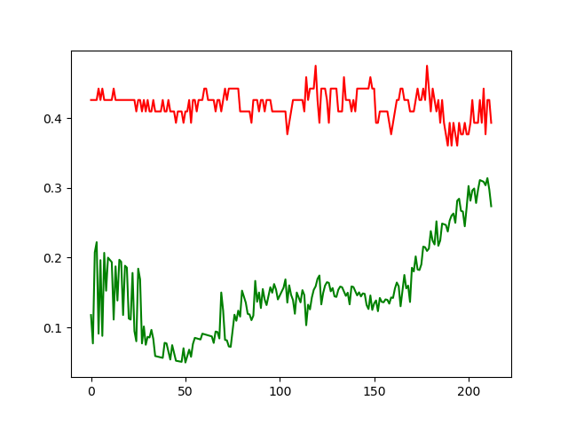
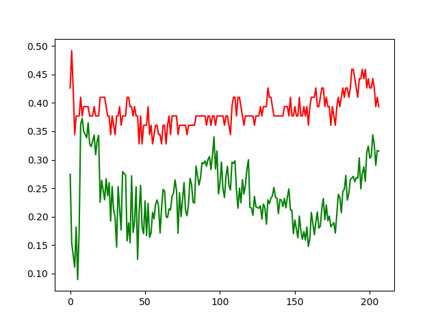
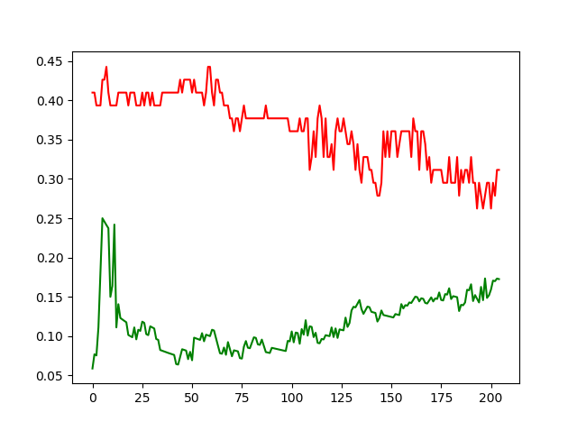
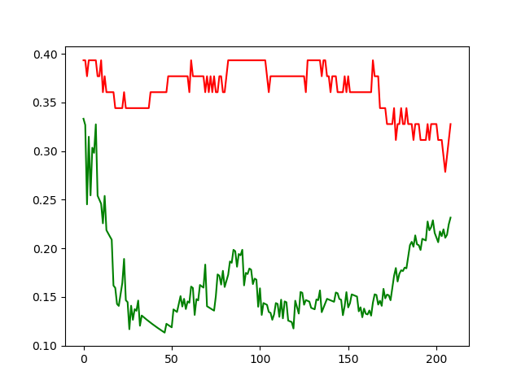
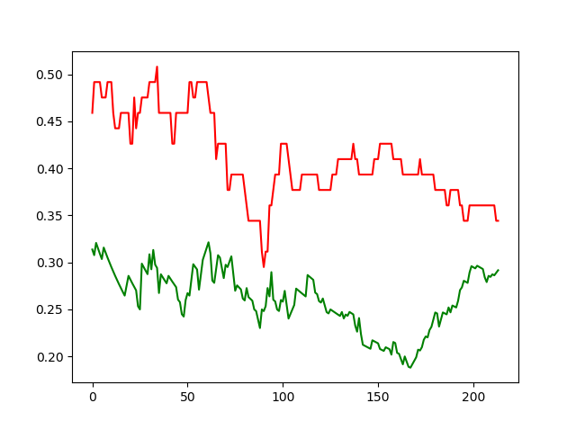

# Active Learning para detectar opiniones en comentarios

## Greidy Valdes C-512
## Ariel Bazán  C-512

## Introducción

En la actualidad la detección de opiniones en comentarios es un problema que generalmente se ataca con aprendizaje supervisado. Esto genera la necesidad de un conjunto de datos clasificados sobre los cuales debe aprender el algoritmo realizado, pero este conjunto de datos no siempre es fácil construirlo. El enfoque que se propone es usar Active Learning junto con algoritmos supervisados para la creación de un corpus lo más pequeño posible a través de ir seleccionando "inteligentemente" los datos a clasificar.

## Creación del conjunto de datos

No fue posible encontrar ningún corpus en español con comentarios y su posterior clasificación en Positivo o Negativo. Por esto, fue necesario crear este corpus. En medio de este proceso se observó que los comentarios no solamente podían ser clasificados en Positivos y Negativos, ya que existían algunos realizando preguntas o añadiendo información. Otros, eran parte positivos y parte negativos. Por esto se decidió añadir dos nuevas opciones y clasificar los primeros como Objetivos y los segundos como Neutros.

De esta forma, utilizando los comentarios de Cubadebate acerca de las 70 tiendas en USD en el país, se construyó un conjunto de datos de 650 comentarios, de los cuales 168 son positivos, 140 negativos, 261 objetivos y 81 neutros.

Como se puede apreciar, el conjunto alcanzado fue muy pequeño y desbalanceado.

## Naturaleza de los Datos

En los datos obtenidos resultó sorprendente la cantidad de errores ortográficos y abreviaturas presentes. Como resulta evidente, esto tiene grandes consecuencias en cualquier representación de los datos ya que resulta más trabajoso encontrar correlación entre palabras con errores.

Otro aspecto que resultó preocupante es lo difícil que fue clasificar los comentarios ya que 2 personas pueden clasificar el mismo texto de manera distinta. Si para una persona esta tarea resulta difícil, muchos pensarían que para una computadora puede ser una tarea imposible.

También existen comentarios que no constituyen una opinión acerca de la noticia sino de comentarios anteriores. Esto puede confundir altamente a cualquier algoritmo de clasificación.

## Active Learning

Se pensó que la técnica de Active Learning es la más adecuada para el problema en cuestión por varias razones. Esta estrategia suele funcionar bien para conjuntos de datos pequeños ya que el propio clasificador selecciona qué datos añadir al conjunto de entrenamiento para definir mejor la superficie de decisión. Lo componen 4 elementos principales:

1. S Estrategia de selección: Es la encargada de seleccionar el próximo elemento a añadir al conjunto de entrenamiento.
2. O Oráculo: Es el que sabe cuál es la verdadera clasificación de un elemento del conjunto de datos. Puede ser, para un conjunto de datos, la clasificación ya conocida de los mismos, o puede necesitar de la intervención humana.
3. Sc Criterio de parada: Determina hasta cuando seguir añadiendo elementos al conjunto de entrenamiento.
4. L y U Etiquetados y no etiquetados: Conjuntos de elementos etiquetados y no etiquetados respectivamente en cada iteración del proceso de Active Learning.

Existe otro elemento que aunque en la literatura no constituye un elemento para active learning en la gran mayoría de los casos es utilizado por la estrategia de selección. Este elemento es el clasificador. 

El clasificador usualmente además de predecir la clase a la que pertenece un elemento permite estimar la probabilidad de que realmente esta sea la correcta. Esto es utilizado por la estategia de selección para escoger, por ejemplo, los casos con menor probabilidad.

## Estrategias de Selección

Una estrategia de selección puede ser cualquier función que, conocidos L y U, seleccione cuáles deben ser los próximos elementos a ser etiquetados por el oráculo.

Se probaron varios tipos de criterios como **uncentain sampling** y **query by committee**.

Uncentain Sampling consiste en seleccionar los elementos del conjunto no etiquetados que, luego de pasarlos por el clasificador, presentan menor probabilidad de pertenencia a su repectiva clase. Esta estrategia trata de seleccionar siempre los elementos más cerca de la frontera de decisión. 

Este criterio aunque en la mayoría de los casos garantizó una alta presición en los elementos utilizados para entrenar no proporcionó resultados significativos en los elementos de validación.

Query by Committee: En esta estrategia se utilizan más de un clasificador y se establece un sistema de votación para seleccionar el próximo elemento a etiquetar.

Esta estrategia posibilitó un mejor balance entre a precisión de los conjunto de validación y entrenamiento.

## Clasificadores

Para el problema en cuestión se utilizaron dos tipos de clasificadores que son buenos en vectores de grandes dimensiones, SVM y KNN. En un principio SVM fue utilizado con distintos tipos de kernels pero siempre catalogaba los elementos de prueba como objetivos aunque el conjuntos de elementos entrenantes estuviera balanceado. No obstante KNN identificaba los nuevos elementos en las 2 categorías pero daba una precisión muy baja para distintos valores de *K*

## Criterios de Paradas

Se utilizó siempre como criterio de parada que la cardinalidad de U fuese 0. Esto se debe a que son tan pocos datos que con ellos no es suficiente para establecer una buena superficie de decisión.

## Representación de documentos
Antes de representar los documentos como vectores se realizaron pre-procesamientos al texto:
1. Llevar todo el texto a letra minúscula
2. Eliminar las palabras con errores ortográficos (que no aparezcan en el diccionario)
3. Tokenizar
4. Eliminar stopwords, signos de puntuación y números
5. Stemming

Se probaron varias representaciones de los datos como Tf,Tf-idf y Doc2Vec. Este último utiliza word-embedings y representa los documentos como un vector de la longitud deseada. 
## Solución propuesta

Después de un largo proceso de experimentación, se utilizaron los siguientes aspectos:

1.  Representación: Se seleccionó Doc2Vec ya que la utilización de word embedings permite una mejor representación de las palabras. Se utilizó un vector de tamaño 150 para representar los comentarios. Esta selección permitió rapidez en los clasificadores ya que trabajaron con vectores relativamente pequeños.
2.  Datos seleccionados: Ninguno de los experimentos realizados permitieron clasificar adecuadamente los datos. Se piensa que esto se debe a que existían muchos comentarios Objetivos y muy pocos Neutros. Por esto se decidió eliminar estos elementos del conjunto de datos y hacer solamente un clasificador en Positivo y Negativo. Luego de esto se separaron el 20% de los datos para validación y el resto para entrenamiento.
3.  Estrategia de Selección: Se utilizó Query by Committee con 5 clasificadores: 2 SVM con kernels lineal y radial respectivamente, 2 KNN con $K= 10$ y $K=20$ y  Naive Bayes.
4.  Criterio de Parada: $|U| = 0$.
5.  Oráculo: Dataset pre-clasificado.

Se utilizó la librería de Python *modAL*. Esta ya tiene impementado una clase *ActiveLearner* que recibe un criterio de selección, los datos y el clasificador. También contiene una clase *Committee* que recibe varios *ActiveLearners*.

## Curva de Aprendizaje

Las siguientes imágenes muestran ejemplo de curvas de aprendizaje en distintos momentos. Como error se uliliza $err = 1 - precisión$ ya que el módulo utilizado no presenta una forma de calcular el error. La línea roja representa el error en los datos de validación y la verde en los datos de entrenamiento.

Como se puede apreciar, en ninguno de los ejemplos el error parece converger, esto parece indicar que no presenta un alto Bias (overfitting).

Aunque al inicio los errores se comportan de manera extraña, se puede apreciar que después de 175 muestras (aproximadamente). 

Las figuras anteriores parecen indicar que el algoritmo propuesto sufre de alta varianza. Esto se aprecia debido a la notable distancia entre las curvas. Normalmente, cuando un algoritmo sufre de alta varianza más datos suelen ayudar.

##  Recomendaciones

En un trabajo futuro, se proponen las siguientes tareas:

1. Corrección ortográfica: Diseñar un corrector autográfico para los datos ya que se eliminó gran parte de los comentario debido a esto.
2. Clasificar más datos.
3. Ampliación manual del vocabulario: se eliminaron palabras que, aunque no aparecen en el diccionario, son importantes en el contexto de una noticia.  